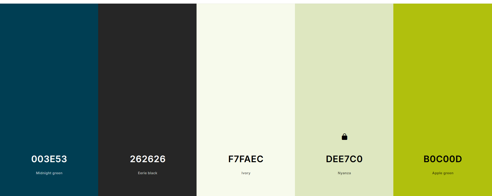

paleta más definitiva
/* CSS HEX */
titulo: #003E53
pie de pagina: #262626;
fondo claro: #f7faec;
fondo más oscuro: #dee7c0;
texto resaltado: #b0c00dff;

colores alternativos
.color1 {color: #4ba3f7;}
.color2 {color: #00cace;}
.color3 {color: #c9eea4;}
.color4 {color: #ffffdc;}
.color5 {color: #ffffff;}
